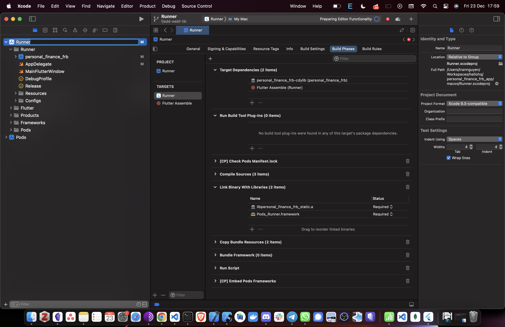

# Step by Step with frb

## 1.Initialize Rust

Run this when starting a new project only. Otherwise, skip to step 2.

Create `src_rust` folder & run `cargo init` command.

## 2. Install Cargo Tools

```sh
cargo install cargo-xcode cargo-lipo
```

## 3. Install target for different platforms

```sh
# Android
rustup target add \
    aarch64-linux-android \
    armv7-linux-androideabi \
    x86_64-linux-android \
    i686-linux-android
```

```sh
# iOS
rustup target add \
    aarch64-apple-ios \
    x86_64-apple-ios \
    aarch64-apple-ios-sim
```

## 4. Update Cargo.toml to use frb

Add crate-type(staticlib for ios and cdylib for other platform) under lib and `flutter_rust_bridge` under dependencies in `Cargo.toml`.

Run these commands.

```sh
flutter pub add ffi flutter_rust_bridge
flutter pub add ffigen --dev
flutter pub global activate ffigen

# and then install llvm.
```

Install `flutter_rust_bridge_codegen` binary:

```sh
# install the flutter_rust_bridge_codegen binary
# in ~/.cargo/bin/flutter_rust_bridge_codegen
cargo install flutter_rust_bridge_codegen
```

Copy this code in `main.dart` to load the rust builds:

```dart
import 'dart:ffi';
import 'dart:io';

import 'package:flutter/material.dart';

import 'bridge_generated.dart';

const base = 'step'; // the name is related with cargo.toml [lib] name.
final path = Platform.isWindows ? '$base.dll' : 'lib$base.so';
late final dylib = Platform.isIOS
    ? DynamicLibrary.process()
    : Platform.isMacOS
        ? DynamicLibrary.executable()
        : DynamicLibrary.open(path);
late final api = SrcRustImpl(dylib);
```

## 5. Setup iOS

1. Generates bindings code between Rust and Flutter, also utilities for Xcode.

    ```sh
    flutter_rust_bridge_codegen -r src_rust/src/api.rs -d lib/bridge_generated.dart -c ios/Runner/bridge_generated.h
    ```

2. Add `lib` target in `Cargo.toml` likes below

   ```toml
    [lib]
    name = "step"
    crate-type = ["staticlib", "lib"]
   ```

3. Builds Rust code into `step.a` and copies the `step.a` into `Runner` directory so that Xcode can search for the
   lib while linking

    ```sh
    cd src_rust \
    cargo lipo && cp target/universal/debug/libstep.a ../ios/Runner 
    ```

4. Declares `#import "bridge_generated.h"` in `Runner-Bridging-Header.h` file & add dummy method in `AppDelegate.swift` file likes below:

    ```swift
    GeneratedPluginRegistrant.register(with: self)
    print("dummy_value=\(dummy_method_to_enforce_bundling())"); // add dummy method here
    return super.application(application, didFinishLaunchingWithOptions: launchOptions)
    ```

5. Open the `ios` folder in Xcode, in **Targets** > **Runner** > **Build Phases** tab, check the `step.a` was in **Link Binary With Libraries**
(If there's error maybe we should ignore arm64 only in **Targets** > **Runner** > **Build Settings**)

## 6. Setup Android

   Run command in `src_rust` folder

   ```sh
    cargo install cargo-ndk && cargo ndk -o ../android/app/src/main/jniLibs build`
    # make sure you sucessfully install NDK)
   ```

## 7. Setup macOS

1. Generates bindings code between Rust and Flutter, also utilities for Xcode.

    ```sh
    flutter_rust_bridge_codegen -r src_rust/src/api.rs -d lib/bridge_generated.dart -c macos/Runner/bridge_generated.h
    ```

2. There is no bridging header file to tell Xcode about our `bridge generated` code. We have to tell Xcode another way, in **Targets** > **Runner** > **Build Settings** tab, set the **Objective-C Bridging Header** to be **Runner/bridge_generated.h**. And add dummy method same as we did in ios setup part:

    ```swift
    // ...
    override func applicationShouldTerminateAfterLastWindowClosed(_ sender: NSApplication) -> Bool {
        print("dummy_value=\(dummy_method_to_enforce_bundling())"); // add dummy method here
        return false
    }
    // ...  
    ```

3. Run `cargo xcode` within Rust directory and it will generate `*.xcodeproj` folder inside Rust project directory. DO NOT open it util you add generated `*.xcodeproj` under `macos` Xcode project.

    

4. Linking the libs by opening **Targets** > **Runner** > **Build Phases** tab:

    - In **Dependencies** add dynamic lib `step-cdylib(.cdylib file)`.

    - In **Link Binary** with Libraries add static lib `step.a (.a file)`.



## 8. Setup Linux

1. Generates bindings code between Rust and Flutter.

    ```sh
    flutter_rust_bridge_codegen -r src_rust/src/api.rs -d lib/bridge_generated.dart
    ```

2. Add `lib` target in `Cargo.toml` likes below:

    ```toml
    [lib]
    name = "step"
    crate-type = ["lib", "staticlib", "cdylib"]
    ```

3. If the machine is not arm64 ,you can use *corrosion* approach [docs](https://cjycode.com/flutter_rust_bridge/template/setup_desktop.html) or a workaround for arm64 is to ignore rust.cmake and manually configure CMake to build and bundle the Rust library.

- Go to **linux/CMakeLists.txt** and adding this to the bottom of `CMakeLists.txt` file.

     ```txt
    set(NATIVE_LIBRARY "${CMAKE_SOURCE_DIR}/../src_rust/target/aarch64-unknown-linux-gnu/release/libstep.so")
    install(FILES "${NATIVE_LIBRARY}" DESTINATION "${INSTALL_BUNDLE_LIB_DIR}"
    COMPONENT Runtime)
     ```

- Generate .so build from terminal.

     ```sh
    cargo build --target aarch64-unknown-linux-gnu --release
     ```

## 9. Setup Window

1. Generates bindings code between Rust and Flutter.

    ```sh
    flutter_rust_bridge_codegen -r src_rust/src/api.rs -d lib/bridge_generated.dart
    ```

2. **Note that**: There are two options. **First option**
   is installing corrosion directly & use it and **Second option** is installing corrosion into the
   machine system.

   - **First Option**

    1. Create rust.cmake inside `windows` folder and add this.

        ```text

            include(FetchContent)
            FetchContent_Declare(
                Corrosion
                GIT_REPOSITORY https://github.com/AndrewGaspar/corrosion.git
                GIT_TAG origin/master # Optionally specify a version tag or branch here
            )
            FetchContent_MakeAvailable(Corrosion)
            corrosion_import_crate(MANIFEST_PATH ../src_rust/Cargo.toml)
            # Flutter-specific
            set(CRATE_NAME "step")
            target_link_libraries(${BINARY_NAME} PRIVATE ${CRATE_NAME})
            list(APPEND PLUGIN_BUNDLED_LIBRARIES $<TARGET_FILE:${CRATE_NAME}-shared>)

        ```

    2. include rust.cmake inside CMakeLists.txt.

       ```text

        include(./rust.cmake)

       ```

   - **Second Option**

    1. Install Corrosion.

       ``` sh
        # make sure cmake is installed.
        git clone https://github.com/corrosion-rs/corrosion.git

        cmake -Scorrosion -Bbuild -DCMAKE_BUILD_TYPE=Release

        cmake --build build --config Release

        cmake --install build --config Release

       ```

    2. Create mrrust.cmake inside `windows` folder add this.

        ```text

            find_package(Corrosion REQUIRED)
            corrosion_import_crate(MANIFEST_PATH ../src_rust/Cargo.toml)

            # Flutter-specific

            set(CRATE_NAME "step")
            target_link_libraries(${BINARY_NAME} PRIVATE ${CRATE_NAME})
            list(APPEND PLUGIN_BUNDLED_LIBRARIES $<TARGET_FILE:${CRATE_NAME}-shared>)
        ```

    3. include mrrust.cmake inside CMakeLists.txt.

       ```text

        include(./mrrust.cmake)

       ```
